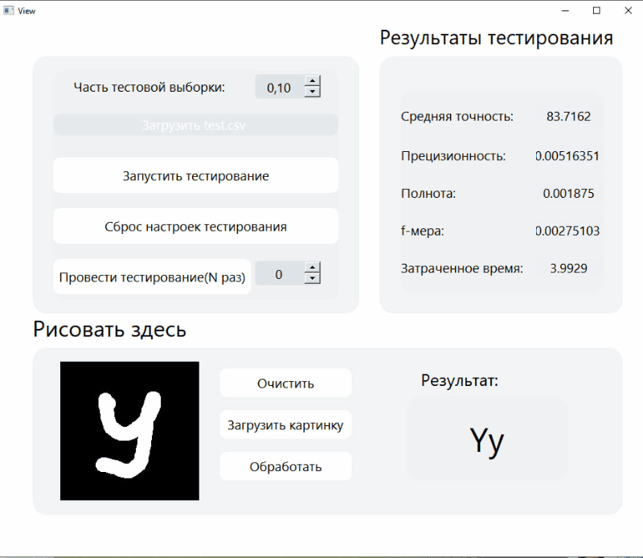

# Multilayer Perceptron

Реализация простейшей нейронной сети в виде перцептрона, которая должна быть обучена на открытом наборе данных и осуществлять распознавание 26 рукописных букв латинского алфавита.

## Information
Про математические модели нейросетей и их обучение смотрите в материалах

### Part 1. Реализация многослойного перцептрона

Результат:

Необходимо реализовать проект MultilayerPerceptron (многослойный перцептрон):
- Полное покрытие unit-тестами модулей, связанных с вычислениями, c помощью библиотеки GTest
- Сборка настроена с помощью Makefile со стандартным набором целей: all, install, uninstall, clean, dvi, dist, tests.
- Реализация с графическим пользовательским интерфейсом, на базе Qt
- Программа предоставляет возможность формировать и обучать модели нейронных сетей для классификации рукописных букв латинского алфавита
- Перцептрон:
  - классифицирует изображения с рукописными буквами латинского алфавита
  - имеет **от 2 до 5** скрытых слоев
  - использует сигмоидальную функцию активации для каждого скрытого слоя
  - обучается на открытом датасете (EMNIST-letters представленным в директории datasets)
  - показывает точность на тестовой выборке *выше 70 процентов*
  - обучается с использованием метода обратного распространения ошибки
- Обучать перцептрон на тестовой выборке **запрещено**
- Реализован перцпетрон *двумя* способами:
  - в матричном виде (все слои представлены в виде матриц весов)
  - в графовом виде (каждый нейрон представляется в виде некоторого объекта узла, связанного с другими узлами по ссылкам)
- Интерфейс программы предоставляет возможность:
  - запустить эксперимент на тестовой выборке или ее части, задаваемой дробным числом от 0 до 1 (где 0 - это пустая выборка - вырожденная ситуация, а 1 - вся тестовая выборка целиком). После выполнения эксперимента на экран должно быть выведена средняя точность (average accuracy), прецизионность (precision), полнота (recall), f-мера (f-measure) и общее затраченное время
  - загружать BMP-изображения (размер изображения может достигать 512x512) с буквами латинского алфавита и осуществлять их классификацию
  - рисовать двухцветные квадратные изображения от руки в отдельном окне
  - запускать процесс обучения в реальном времени для заданного пользователем количества эпох с выводом на экран контрольных значений ошибки для каждой эпохи обучения. Предусмотреть возможность составление отчета в виде графика изменения ошибки, посчитанной на тестовой выборке, для каждой эпохи обучения
  - запускать процесс обучения с применением кросс-валидации для заданного числа групп _k_
  - переключать реализацию перцпетрона (матричная или графовая)
  - переключать количество скрытых слоев перцептрона (от 2 до 5)
  - сохранять в файл и загружать из файла веса перцептронa

### Part 2. Дополнительно. Исследование

Сравнение производительности двух реализаций перцептрона: графовой и матричной лежит в src.
